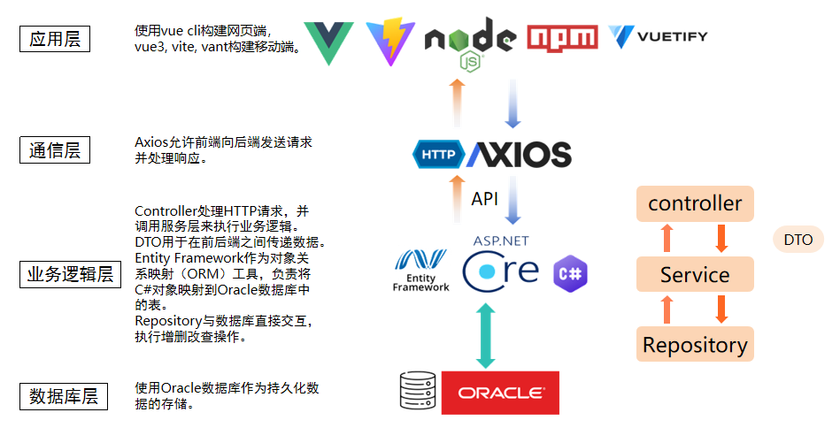

# 长者食堂管理系统

本项目为同济大学2024年数据库课程设计项目作业。

## 项目介绍

“济人之老，食在幸福”长者食堂管理系统

## 仓库组成

- 前端
  - 网页端（本仓库）
  - [移动端](https://github.com/359jxf/elderly_canteen_management_system_mobile_frontend)
- [后端](https://github.com/vapacity/Elderly_Canteen_backend)

## 系统架构

## 项目运行

切换到release分支，`npm install`然后`npm run serve`
